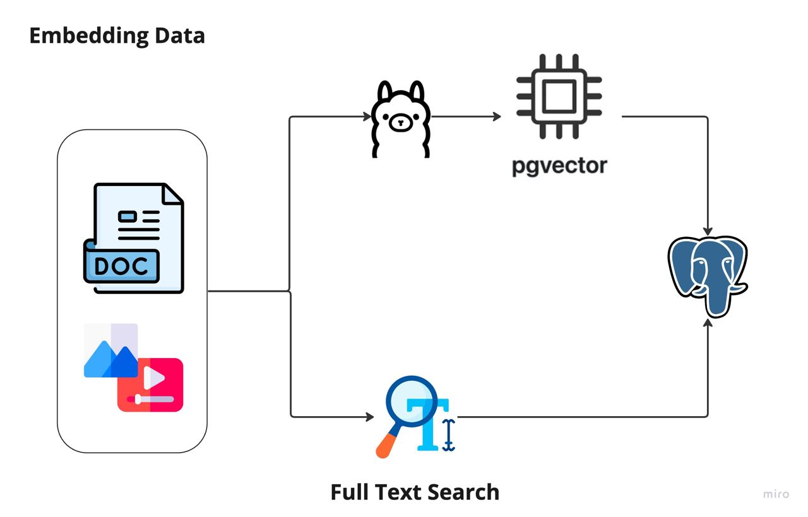
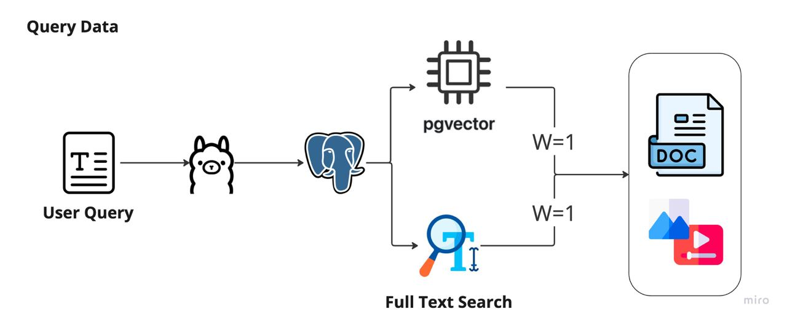

# Movie Hybrid Search

A hybrid search engine for movies that uses a combination 
**Vector Based Search** and **Full Text Search**.
The project is running fully on local machine with the help of **Ollama** and **llama3**. 

## How to run the project

1. Clone the repository
2. Run start script
    ```shell
    sh run.sh
    ```
   
## Example ##

```shell
curl --location 'http://localhost:8080/movie/search?term=goodzilla%20x%20kingkong'
```

## Technologies in use ##

- [Ollama](https://github.com/ollama/ollama)
  Running with large language models locally
- [llama3](https://ollama.com/library/llama3)
  Meta Llama 3: The most capable openly available LLM to date
- [Postgres](https://www.postgresql.org/)
  Database for storing movie vector and full text search
- [Spring Boot](https://spring.io/projects/spring-boot)
  Framework for building Java-based enterprise applications

## How it works ##
There is 2 steps in the search process:
1. Embedding data:
   
2. Query data:
   
